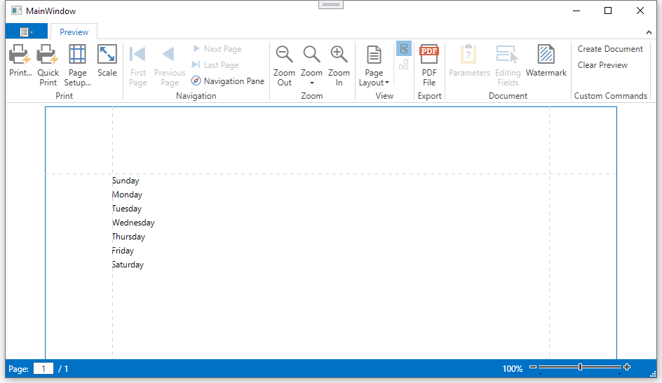

<!-- default badges list -->

<!-- default badges end -->
# DocumentPreviewControl - How to Customize the Toolbar

This example demonstrates how to customize the [DocumentViewerControl](https://docs.devexpress.com/WPF/9697/controls-and-libraries/printing-exporting/concepts/document-preview) toolbar.
It shows how to remove standard commands from a Ribbon toolbar, and add custom commands.

The example implements a custom command provider ([DocumentCommandProvider](https://docs.devexpress.com/WPF/DevExpress.Xpf.Printing.DocumentCommandProvider) and uses [Bar Actions](https://docs.devexpress.com/WPF/7045/controls-and-libraries/ribbon-bars-and-menu/bars/bar-actions) to modify the toolbar.

## Files to Review

* [MainWindow.xaml](./CS/MainWindow.xaml) (VB: [MainWindow.xaml](./VB/MainWindow.xaml))
* [MainWindow.xaml.cs](./CS/MainWindow.xaml.cs) (VB: [MainWindow.xaml.vb](./VB/MainWindow.xaml.vb))

## Documentation

- [Customize the Document Preview Toolbar](https://docs.devexpress.com/XtraReports/9400/wpf-reporting/wpf-reporting-document-preview/api-and-customization/customize-the-document-preview-toolbar)
- [Quick Guide to Print Preview Customization](https://docs.devexpress.com/XtraReports/119228/wpf-reporting/wpf-reporting-document-preview/api-and-customization/quick-guide-to-print-preview-customization)

## More Examples

- [How to Use ViewModel Data as Report Parameters in a WPF MVVM Application](https://github.com/DevExpress-Examples/reporting-wpf-mvvm-viewmodel-data-to-report)
- [How to Use the DocumentPreviewControl in a WPF MVVM Application to Preview a Report](https://github.com/DevExpress-Examples/reporting-wpf-mvvm-show-report-document-preview)

